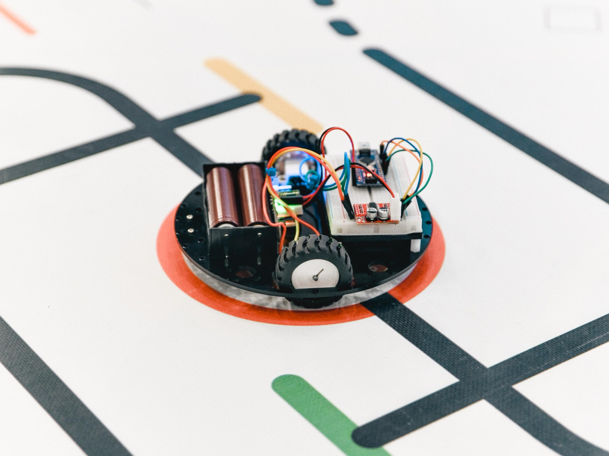

# Arduino-Robotics-Lessons
Interactive curriculum for teaching robotics with Arduino. Includes markdown guides, Arduino-schemes and starter code with tasks.
Учебная программа для обучения робототехнике с использованием Arduino. Включает руководства в формате Markdown, схемы Arduino и стартовый код с заданиями.

## 📖 О курсе

Данный курс разработан для учеников 9 класса и посвящен созданию и программированию двухколесного автономного робота. 

Раздел направлен на закрепление пройденного материала по:
- Сборке электрических схем на беспаечной макетной плате (breadboard).
- Базовому программированию микроконтроллеров Arduino.
- Продвинутому программированию на C/C++ (создание собственных функций, работа с таймерами, алгоритмы фильтрации сигналов и ПИД-регуляторы).

---

## 📚 Оглавление курса

1. [Урок 1: Базовое движение и драйвер MX1508](./lesson-01-basic-movement/)
2. [Урок 2: Движение по линии, ПД-регулятор](./lesson-02-line-follower-pd/)
3. [Урок 3: Движение по линии, ПИД-регулятор и подсчет перекрестков](./lesson-03-line-follower-pid/)
4. [Урок 4: Объезд препятствий, ультразвуковой датчик расстояния](./lesson-04-obstacle-avoidance/)

---

## 🛠️ Оборудование и материалы

Для выполнения заданий и прохождения курса потребуется компьютер с установленной средой **Arduino IDE**, а также следующий набор компонентов:

### Электроника:
- Arduino Nano (с кабелем для прошивки)
- Беспаечная макетная плата (Breadboard)
- Шасси робота с двумя моторами постоянного тока
- Плата питания со сборкой 2 Li-ion аккумуляторов 18650
- Драйвер моторов MX1508
- Аналоговые оптические датчики линии (2 шт.)
- Ультразвуковой дальномер HC-SR04
- Набор соединительных проводов (перемычки папа-папа, мама-папа)

### 🗂️ Чертежи и исходники
Все дополнительные материалы для производства шасси своими силами находятся в папке [`/hardware`](./hardware/):
- **Список компонентов (BOM)** с рекомендациями по сборке
- **.DXF чертежи** (для лазерной резки корпуса)
- **.STL модели** (для 3D-печати креплений)
- **Gerber-файлы** (для заказа кастомных печатных плат)
