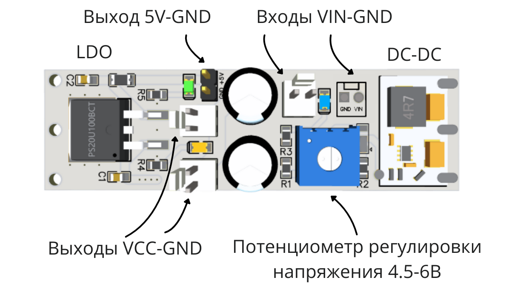
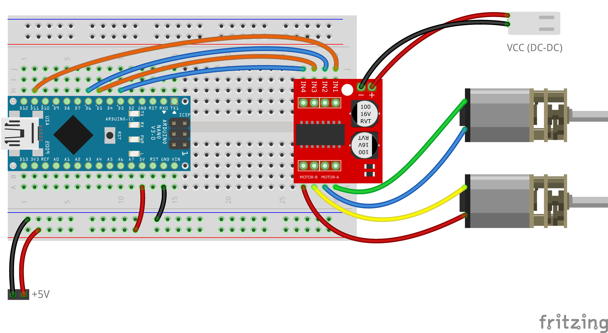

# Урок 1: Сборка робота и первое движение

На этом уроке мы научимся собирать робота, коммутировать линии питания и напишем простую программу для работы с драйвером MX1508.

## ⚡ Как работает питание робота?

Прежде чем собирать схему, давай разберемся, откуда робот берет энергию. **Модуль питания** получает энергию от двух мощных аккумуляторов Li-ion (напряжение 7.4 – 8.4 Вольта) и безопасно распределяет её по роботу.

### Зачем нам две разные линии напряжения?
Роботу нужны два независимых источника питания, чтобы он работал стабильно и не зависал:
1. **Для логической части (Arduino и датчики)** желательно идеально чистое и стабильное напряжение **5 Вольт**. 
2. **Для силовой части (моторы)** нужно много тока. При старте или под нагрузкой моторы создают сильные помехи и забирают много энергии. 

Если питать всё от одной линии, помехи от моторов могут привести к различным "глюкам": перезагрузке, неправильным GPIO-уровням (уровням на пинах Arduino), к помехам при измерении напряжения при помощи АЦП. Поэтому наш модуль делит энергию на две отдельные линии.

### 📊 Характеристики модуля питания

| Линия на плате | Напряжение | Макс. ток | Светодиод | Зачем нужна? |
| :--- | :--- | :--- | :--- | :--- |
| **VIN-GND** (Вход) | 7.4 – 8.4 В | 3 А | Синий 🔵 | Сюда подключаются аккумуляторы. Линия защищена предохранителем от короткого замыкания (КЗ). |
| **VCC-GND** (DC-DC)| **5.2 В** (фикс.) | 3 А | Желтый 🟡 | **Для питания моторов**. *Примечание: в нашем модуле напряжение зафиксировано перемычкой на 5.2 В (крутить потенциометр не нужно).* |
| **5V-GND** (LDO) | 5 В | 1 А | Зеленый 🟢 | **Для питания Arduino и датчиков**. Используется линейный стабилизатор (LDO) для максимально чистого сигнала. |

> **⚠️ Защита:** На каждой линии стоит свой предохранитель. Если при подключении один из светодиодов (синий, желтый или зеленый) погас — сработала защита от короткого замыкания. Немедленно отключи аккумуляторы и проверь правильность схемы!

## 🔌 Схема подключения

*(Внимание: если моторы крутятся не в ту сторону, просто поменяй местами два провода, которые подключают моторы к драйверу)*

## 📖 Теория: Функция `motors()`
Чтобы не писать каждый раз команды для 4-х разных пинов, мы будем использовать готовую функцию:
`motors(скорость_левого, скорость_правого);`

- Скорость может быть от **0 до 255** (движение вперед).
- Если передать **отрицательное число** (например, -150), мотор будет крутиться **назад**.
- Если передать **0**, мотор остановится.

## 💻 Задание
1. Открой папку `starter_code` и скачай файл `starter_code.ino`.
2. Загрузи его в Arduino IDE.
3. Изучи код и выполни задания в блоке `loop()`, отмеченные комментариями `// TODO`. 
4. Постарайся заставить робота проехать вперед, развернуться и остановться
