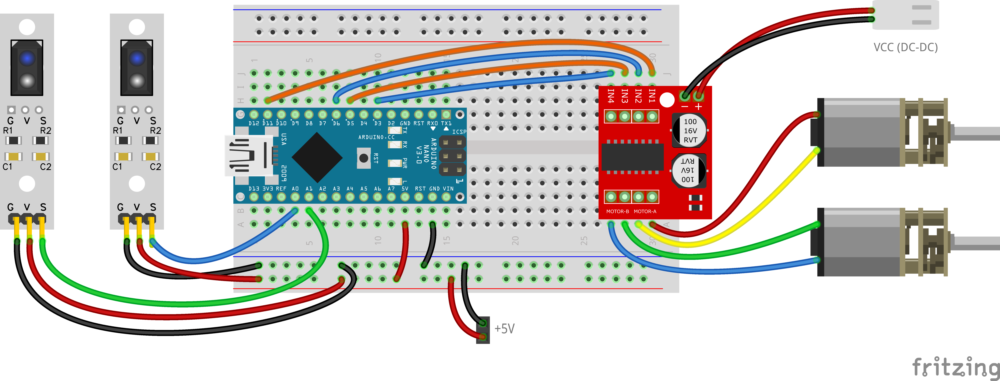

# Урок 2: Зрение робота (Аналоговые датчики линии)

Двигаться по заранее описанному маршруту не интересно. На сложной трассе мы не будем знать, в какие моменты нужно поворачивать. Сегодня мы подключим инфракрасные (ИК) датчики линии и заставим робота ехать по черной полосе.

## 👁️ Как работают датчики?
На датчике есть два светодиода: один излучает инфракрасный свет, а второй (фототранзистор) ловит отражение.
- **Белый цвет** (стол/бумага) отлично отражает свет. Датчик выдает высокое значение.
- **Черный цвет** (изолента) поглощает свет. Отражения почти нет, датчик выдает низкое значение.

Мы подключим левый датчик к пину **A1**, а правый — к пину **A0**. Буква `A` означает, что пин *Аналоговый*: он читает не просто 0 и 1, а значения от 0 до 1023 (функция `analogRead()`).

## 🔌 Схема подключения

## 💻 Задание 1: Калибровка
1. Загрузи стартовый код в робота и открой **Монитор порта** (Лупа в правом верхнем углу Arduino IDE, скорость 9600).
2. Поставь робота левым датчиком на белое, а правым на черное. Посмотри, какие числа бегут на экране.
3. Найди **коэфициент баланса** (число, которое позволит двум датчикам выдавать одинаковое значение на белом фоне). Запиши это число в переменную `sensorBalance`.

## 💻 Задание 2: Простой алгоритм (Релейный)
Используя конструкцию `if - else`, научи робота рулить:
- Если **левый** датчик видит черное (значение больше/меньше порога) ➔ подруливаем **налево** (левый мотор назад, правый вперед).
- Если **правый** датчик видит черное ➔ подруливаем **направо**.
- Если оба датчика на белом ➔ едем **прямо**.
