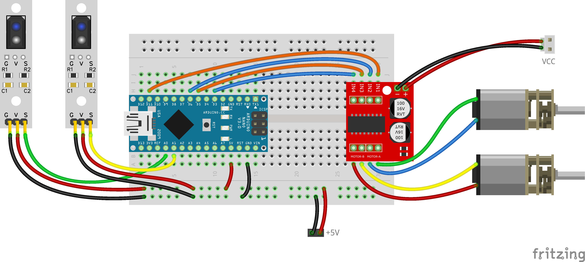

# Урок 2: Зрение робота (Аналоговые датчики линии)

Двигаться по заранее описанному маршруту неинтересно. На сложной трассе мы не будем знать, в какие моменты нужно поворачивать. Сегодня мы подключим инфракрасные (ИК) датчики линии и заставим робота ехать по черной полосе.

## 👁️ Как работают датчики?
На датчике есть два светодиода: один излучает инфракрасный свет, а второй (фототранзистор) ловит отражение.
- **Белый цвет** (стол/бумага) отлично отражает свет. Датчик выдает высокое значение.
- **Черный цвет** (чёрная линия) поглощает свет. Отражения почти нет, датчик выдает низкое значение.

Мы подключим левый датчик к пину **A0**, а правый — к пину **A1**. Буква `A` означает, что пин *Аналоговый*: он читает не просто 0 и 1, а значения от 0 до 1023 (для этого мы используем функцию `analogRead()`).

## 🔌 Схема подключения

## 💻 Задание 1: Калибровка
1. Загрузи стартовый код в робота.
2. Открой **Плоттер по последовательному порту** (или Монитор порта) в правом верхнем углу Arduino IDE (скорость 9600).
3. Поставь робота левым датчиком на белое, а правым на черное. Посмотри на графики (или бегущие числа) на экране.
4. Найди **коэффициент баланса** — число, которое позволит двум датчикам выдавать одинаковое значение на одинаковом фоне, если один из них оказался чуть "слепее" другого. Запиши это число в переменную `sensorBalance`.

## 🧠 Задание 2: ПД-регулятор

Можно было бы использовать простой алгоритм `if-else`. Если видим белое — поворачиваем, пока опять не увидим черное. Так работает **релейный регулятор**: робот видит край линии и резко поворачивает на фиксированный угол. Из-за этого он дергается.

**Пропорциональный (П) регулятор** работает умнее: чем сильнее робот съехал с линии (чем больше ошибка), тем сильнее он подруливает, делая движение плавнее.

А **Пропорционально-дифференциальный (ПД) регулятор** добавляет предсказание: он смотрит, *насколько быстро* меняется ошибка, и учитывает это в расчете. Благодаря этому робота не болтает из стороны в сторону, он не вылетает на поворотах и едет идеально ровно даже на высокой скорости!

> 💡 В общем случае, **ПИД-регулятор** — это алгоритм, который рассчитывает силу управляющего воздействия в зависимости от ошибки. В нашем случае *ошибка* — это разность показаний левого и правого датчиков, а *управляющее воздействие* — разница в мощности, подаваемой на левое и правое колесо.

## 💻 Что нового в коде?
Мы **не меняем** функцию `motors()` — она перешла к нам с первого урока.
Вместо этого мы добавляем новую функцию — `followLine()`. Это и есть наш ПД-регулятор, который будет высчитывать ошибку и плавно изменять скорости левого и правого моторов.

**Твоя задача:**
1. Изучи формулу вычисления ошибки `err` и управления `control` в функции `followLine()`.
2. В функции `loop()` закомментируй функцию калибровки `sensors()`, чтобы робот не тормозил при выводе текста на экран, и раскомментируй `followLine()`.
3. Попробуй менять коэффициенты `kp` (П-коэффициент) и `kd` (Д-коэффициент).
4. Найди идеальные значения, при которых твой робот пройдет трассу быстрее всего и не вылетит с нее!
